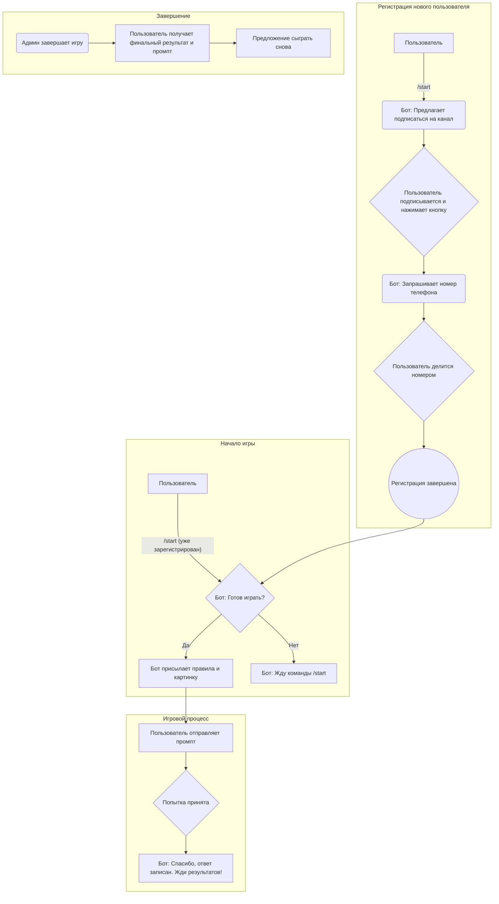

# 🥊 Битва промптов (Telegram Bot)

Участникам показывается картинка, и они должны угадать, какой промпт использовался для её генерации.

## 🚀 Возможности

- **Админ создаёт игру**: Загружает картинку и задаёт истинный промпт.
- **Автоматический старт**: Сразу после создания игра становится активной, и всем пользователям бота отправляется уведомление.
- **Пошаговая регистрация**: Новый пользователь проходит простую регистрацию: подписка на канал и отправка номера телефона.
- **Запоминание пользователей**: Бот запоминает зарегистрированных пользователей и не просит их проходить регистрацию повторно.
- **Семантический анализ ответов**: Каждый предложенный промпт оценивается на смысловую близость к истинному с помощью нейросети (`sentence-transformers`).
- **Одна попытка**: У каждого игрока есть только 1 попытка, чтобы угадать промпт.
- **Скрытые результаты**: Для честной игры результат (процент схожести) не показывается до конца рау
нда.
- **Гибкий экспорт результатов**: Админ может выгрузить результаты любой завершённой игры в **Excel**, выбрав один из двух форматов:
    1.  **Лучшие попытки**: Только самый высокий результат для каждого участника.
    2.  **Все попытки**: Полная история ответов всех участников.
- **Информативные отчёты**: В Excel-файле содержатся никнейм, номер телефона, предложенный промпт, очки и точное время ответа.
- **Завершение раунда**: По команде админа игра останавливается, и всем участникам приходит их итоговый результат, правильный промпт и имя победителя.
- **Управление пользователями**: Админ может отправлять личные сообщения любому пользователю через бота.

## 📖 Команды

### 👤 Пользователь
- `/start` - Начать или перезапустить бота.
- `/help` - Получить список доступных команд.

### 👑 Админ
- `/help` - Показать расширенный список команд администратора.
- `/makegame` - Начать процесс создания новой игры (бот запросит фото и промпт).
- `/stopgame` - Остановить текущую активную игру и подвести итоги.
- `/excel` - Получить отчёт по результатам одной из завершённых игр.
- `/senduser <user_id> <message>` - Отправить личное сообщение пользователю.

## 🔄 Схема взаимодействия

### 👑 Флоу Администратора

```mermaid
graph TD
    subgraph "Создание и запуск игры"
        A[Админ] -- /makegame --> B(Бот: Загрузите фото);
        B --> C[Админ отправляет фото];
        C --> D(Бот: Введите промпт);
        D --> E[Админ отправляет промпт];
        E --> F((Игра создана и активна));
        F --> G[Рассылка всем пользователям];
    end

    subgraph "Завершение игры"
        H[Админ] -- /stopgame --> I(Бот: Останавливает игру);
        I --> J[Рассылка результатов участникам];
        J --> K[Предложение сыграть в новый раунд];
    end

    subgraph "Экспорт результатов"
        L[Админ] -- /excel --> M(Бот: Выберите игру);
        M --> N[Админ выбирает игру из списка];
        N --> O(Бот: Выберите тип отчёта);
        O --> P[Админ выбирает тип];
        P --> Q[/Отправка .xlsx файла/];
    end
```

### 👤 Флоу Пользователя

## 💬 Тексты сообщений

### Шаг 1: Запрос подписки
> Приветствую в «Битве Промптов»✨
>
> Чтобы присоединиться к соревнованию, тебе необходимо быть подписчиком нашего канала. Подпишись и нажми кнопку «✅ Я подписался(ась)», чтобы продолжить.
>
> **Кнопки:** `[↗️ Перейти в канал]`, `[✅ Я подписался(ась)]`

### Шаг 2: Запрос номера телефона
> Здорово! Ты с нами 🚀
>
> Для связи в случае победы нам нужен твой номер телефона. Поделись им, нажав кнопку ниже 👇
>
> Или просто напиши его в формате: +7 XXX XXX XX XX
>
> **Кнопка:** `[📞 Отправить мой номер]` (Reply-кнопка)

### Шаг 3: Подтверждение готовности
> Отлично, всё готово для старта! Ты готов(а) сыграть прямо сейчас?
>
> **Кнопки:** `[🎯 Да, начинаем!]`, `[⏰ Не сейчас]`

### Если пользователь уже зарегистрирован
> С возвращением! Готов(а) сыграть прямо сейчас?
>
> **Кнопки:** `[🎯 Да, начинаем!]`, `[⏰ Не сейчас]`

### Правила игры (если выбрал «Да, начинаем!»)
> Супер! Вот правила:
>
> 1. Я отправлю тебе уникальное изображение, сгенерированное нейросетью.
> 2. Твоя задача — угадать, какой промт (текстовый запрос) был использован для его создания.
> 3. У тебя будет 1 попытка, чтобы предложить свой вариант. Чем точнее твой промт — тем выше шанс на победу!
>
> Внимание! Чтобы все играли честно, я не буду показывать процент схожести до конца раунда. Когда раунд завершится, я подведу итоги, пришлю правильный промт и твой результат.
>
> Удачи 🏆
>
> _[Бот сразу после этого сообщения присылает изображение]_

### После отправки промпта
> ✅ Спасибо! Твой ответ записан. Жди результатов!

### Если выбрал «Не сейчас»
> Когда будешь готов(а) — просто напиши мне команду /start, и мы начнём.

### Сообщение после окончания раунда (рассылается всем участникам)
> 🥁 Время подвести итоги! Раунд завершён!
>
> Оригинальный промт был: «...[текст промта]...»
>
> 🏆 Победитель этого раунда: [@username] с результатом [X]%!
>
> Твой результат: [Y]%
>
> Спасибо за участие! До следующей битвы! ✨

### Сообщение о начале нового раунда
> 🔥 Стартует новый раунд! Готов(а) снова бросить вызов нейросети?
>
> **Кнопки:** `[🎯 Да, начинаем!]`, `[⏰ Не сейчас]`

# Изменение
1. Убрать фото на старте раунда
2. Поправить распознование (тут дополнить)
3. Надо сделать отложенные игры 
    3.1. Добавляются игры через /makegame
    3.2. /startgame - запускает первую игру 
    3.3. /continuegame - запускает следующую игру
    3.4. /stopgame - остановить игру 
4. При вводе номера телефона
Перенос кнопки с клавиатуры на Inline(к сообщению)
убрать: Или просто напиши его в формате: +7 XXX XXX XX XX
5. Перед отправкой правил нужно проверять на наличие активной игры
6. Изменить порядок регистрацию
    6.1. Приветственное сообщение
    6.2. Сообщение о подписке на канал
    6.3. Сообщение о номере телефона
7. Если человек не подписался у него должно быть сообщение об этом, но не такое как при регистрации.
8. Сообщение о продолжении после конца раунда надо убрать:
### Сообщение о начале нового раунда
> 🔥 Стартует новый раунд! Готов(а) снова бросить вызов нейросети?
>
> **Кнопки:** `[🎯 Да, начинаем!]`, `[⏰ Не сейчас]`
9. Не отправлять всем кто выиграл, а только админам 