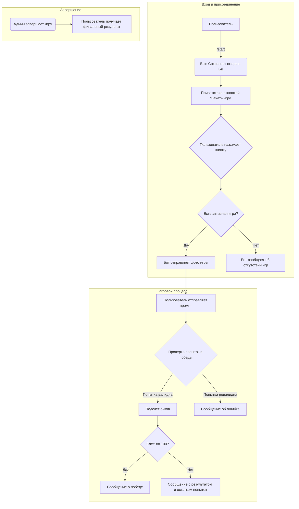

# 🥊 Битва промптов (Telegram Bot)

Участникам показывается картинка, и они должны угадать, какой промпт использовался для её генерации.

## 🚀 Возможности

- **Админ создаёт игру**: Загружает картинку и задаёт истинный промпт.
- **Автоматический старт**: Сразу после создания игра становится активной, и всем пользователям бота отправляется уведомление с изображением.
- **Простой вход в игру**: Пользователи нажимают кнопку "Начать игру" под приветственным сообщением, чтобы присоединиться к текущему раунду.
- **Семантический анализ ответов**: Каждый предложенный промпт оценивается на смысловую близость к истинному с помощью нейросети (`sentence-transformers`). Оценка выставляется по шкале от 0 до 100.
- **Три попытки**: У каждого игрока есть 3 попытки на то, чтобы угадать промпт.
- **Мгновенная победа**: Если игрок набирает 100 очков, его участие в текущем раунде успешно завершается.
- **Гибкий экспорт результатов**: Админ может выгрузить результаты любой завершённой игры в **Excel**, выбрав один из двух форматов:
    1.  **Лучшие попытки**: Только самый высокий результат для каждого участника.
    2.  **Все попытки**: Полная история ответов всех участников.
- **Информативные отчёты**: В Excel-файле содержатся никнейм, предложенный промпт, очки и точное время ответа.
- **Завершение раунда**: По команде админа игра останавливается, и всем участникам приходит их итоговый результат и правильный промпт.
- **Управление пользователями**: Админ может отправлять личные сообщения любому пользователю через бота.
- **Проверка подписки**: (Опционально) Можно настроить проверку подписки на Telegram-канал для доступа к боту.

## 📖 Команды

### 👤 Пользователь
- `/start` - Показать приветственное сообщение и кнопку "Начать игру".
- `/help` - Получить список доступных команд.

### 👑 Админ
- `/help` - Показать расширенный список команд администратора.
- `/makegame` - Начать процесс создания новой игры (бот запросит фото и промпт).
- `/stopgame` - Остановить текущую активную игру и подвести итоги.
- `/excel` - Получить отчёт по результатам одной из завершённых игр.
- `/senduser <user_id> <message>` - Отправить личное сообщение пользователю.

## 📦 Пример Excel

| user_id | ник     | предложенный промпт        | очки | время ответа              |
| ------- | ------- | -------------------------- | ---- | ------------------------- |
| 12345   | user123 | a cat sitting on the table | 95   | 2025-08-27 12:30:05.123456 |
| 67890   | anna    | kitten on wooden desk      | 82   | 2025-08-27 12:31:10.654321 |
| 54321   | ivan    | a cat on the desk          | 92   | 2025-08-27 12:32:15.987654 |

## 🔄 Схема взаимодействия

### 👑 Флоу Администратора

```mermaid
graph TD
    subgraph "Создание и запуск игры"
        A[Админ] -- /makegame --> B(Бот: Загрузите фото);
        B --> C[Админ отправляет фото];
        C --> D(Бот: Введите промпт);
        D --> E[Админ отправляет промпт];
        E --> F((Игра создана и активна));
        F --> G[Рассылка всем пользователям];
    end

    subgraph "Завершение игры"
        H[Админ] -- /stopgame --> I(Бот: Останавливает игру);
        I --> J[Рассылка результатов участникам];
    end

    subgraph "Экспорт результатов"
        K[Админ] -- /excel --> L(Бот: Выберите игру);
        L --> M[Админ выбирает игру из списка];
        M --> N(Бот: Выберите тип отчёта);
        N --> O[Админ выбирает тип];
        O --> P[/Отправка .xlsx файла/];
    end
```

### 👤 Флоу Пользователя

